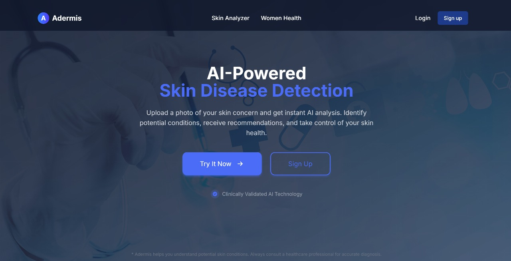
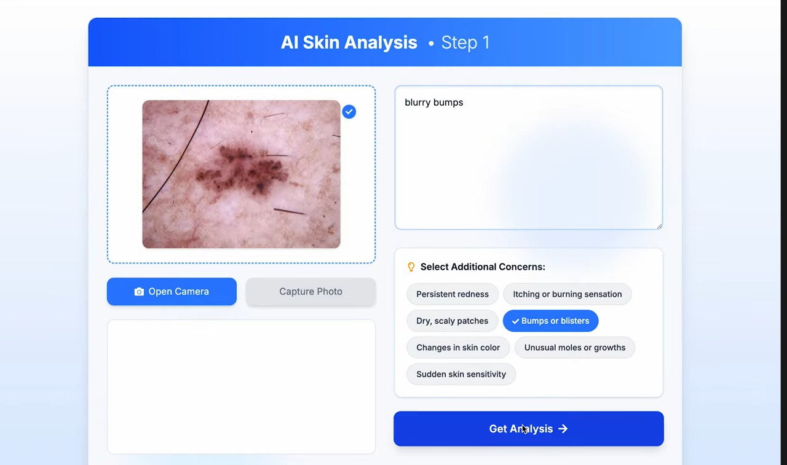
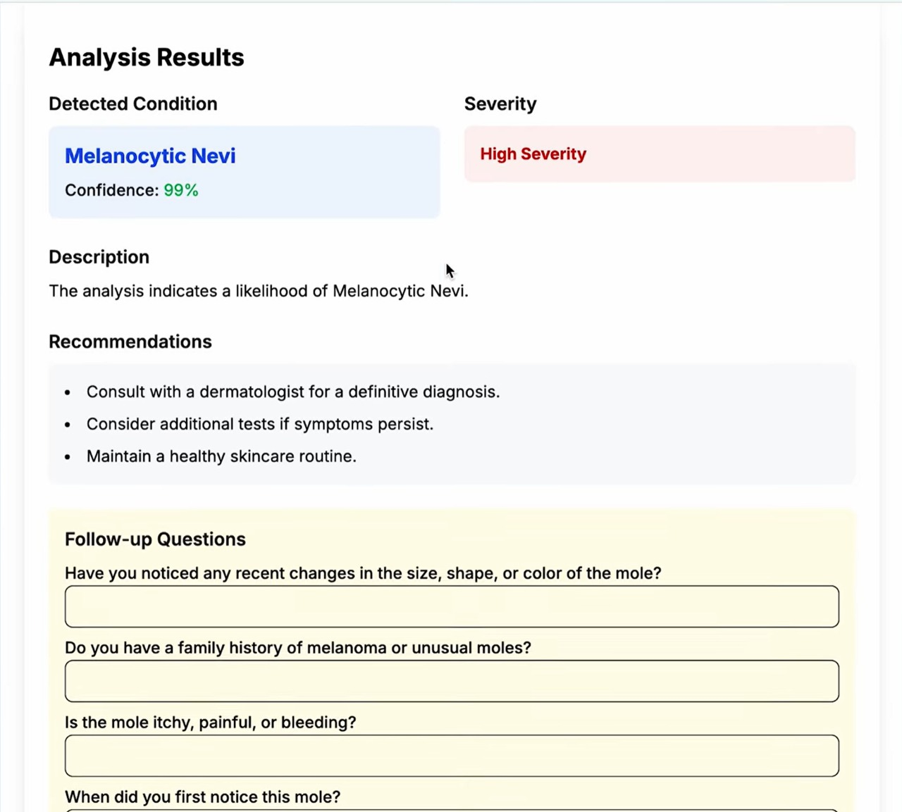
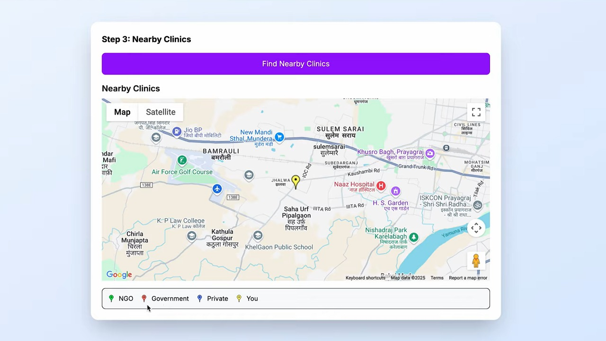
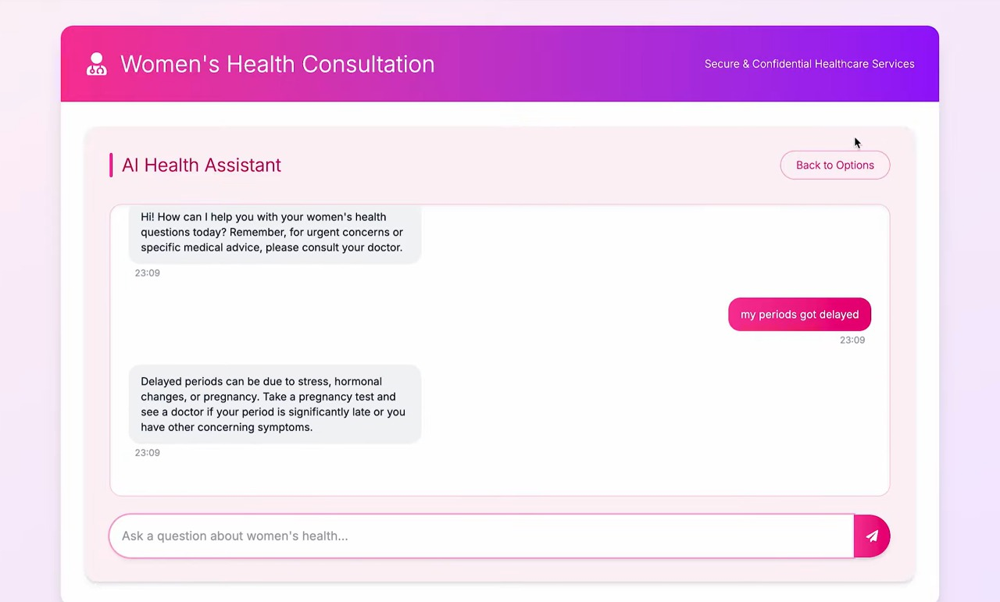
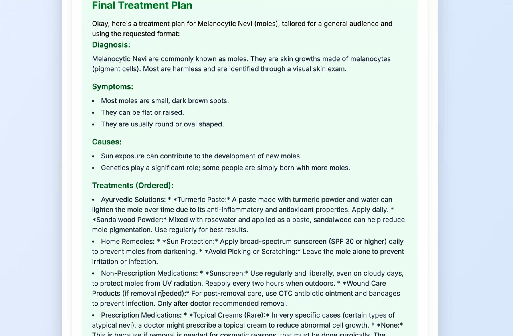

# Skin Disease Prediction Web App

A full-stack AI-powered web application to predict skin diseases from user-uploaded images and provide follow-up analysis and treatment recommendations.
Adermis is a full-stack, AI-driven web application that empowers users to:
1. **Upload** skin images for instant disease detection  
2. **Answer** follow-up questions to refine your diagnosis  
3. **Locate** nearby clinics or pharmacies via Google Maps API  
4. **Chat** confidentially about women’s health concerns  
5. **Receive** a tailored treatment plan  

---
## 🚀 Demo Gallery

### 1. Dashboard & Upload Interface  
  
*Upload a photo of your skin concern and select additional symptoms.*

---

### 2. Entering Disease Info & Concerns  
  
*Describe your lesion and pick related concerns (redness, bumps, etc.).*

---

### 3. AI Analysis Result  
  
*Our model identifies “Melanocytic Nevi” with confidence and severity.*

---

### 4. Nearby Clinics & Pharmacies  
  
*Find NGOs, government, private clinics or pharmacies near you.*

---

### 5. Women’s Health Chatbot  
  
*Secure, confidential chat for women’s health questions (e.g., delayed periods).*

---

### 6. Final Treatment Plan  
  
*Ayurvedic remedies, home care, OTC options, and prescription guidance.*

---
- **Skin Disease Detection**  
  - Pre-trained deep learning model (e.g. ResNet50) classifies common skin conditions.  
  - Confidence scores & severity levels.  
- **Dynamic Follow-Up**  
  - Contextual questions refine accuracy.  
- **Treatment Recommendations**  
  1. **Ayurvedic Solutions** 🪔  
  2. **Home Remedies** 🏡  
  3. **Over-The-Counter (OTC)** 💊  
  4. **Prescription Drugs** 🧾  
- **Location Services**  
  - Google Maps API to find nearby clinics, pharmacies, NGOs.  
- **Women’s Health Assistant**  
  - Chat UI for gynecological concerns powered by OpenAI’s Chat API.  
- **Secure & Confidential**  
  - Binary-encoded requests/responses, GDPR-compliant.

---
## Architecture Overview

Frontend (Next.js) <--> API Gateway <--> ML Server (Python)
                                        |
                                        --> Image Classification Model
                                        --> Follow-up Logic Handler

---

## Getting Started

## # 1. Clone the repository

Using git clone command clone the repository

## # 2. Set up the backend

cd backend
pip install -r requirements.txt
python app.py

## # 3. Set up the frontend

cd ../frontend
npm install
npm run dev

---

## 📝 Treatment Format

The final solution page displays treatments in this order:

1. **Ayurvedic Solution** 🪔
2. **Home Remedies** 🏡
3. **Over-the-counter (OTC)** 💊
4. **Prescription Drugs** 🧾

Each with a short 1–2 line explanation.

---

## 🧪 Testing

To test the model and flow:

1. Upload a valid image of a skin condition.
2. Fill follow-up form (dynamic based on prediction).
3. View final disease + treatments on `/solution`.

---

## 📚 Future Enhancements

- User authentication and history tracking
- Multilingual support for rural accessibility
- Integration with dermatologists or telehealth platforms
- Feedback loop for improving model accuracy

---

## 👨‍⚕️ Disclaimer

This app is for **educational and informational purposes only**. It is **not a substitute for professional medical advice**. Always consult a certified dermatologist for real-world concerns.

---

## 🧑‍💻 Contributing

1. Fork the repo
2. Create your feature branch: `git checkout -b feature/xyz`
3. Commit your changes: `git commit -am 'Add xyz'`
4. Push to the branch: `git push origin feature/xyz`
5. Submit a pull request
